# Full System Architecture Map

Below is the complete infrastructure and architecture of Molebie AI, broken down into multiple diagrams covering every layer.

---

## 1. High-Level Architecture (All Services)

This is the bird's-eye view of how every component connects:

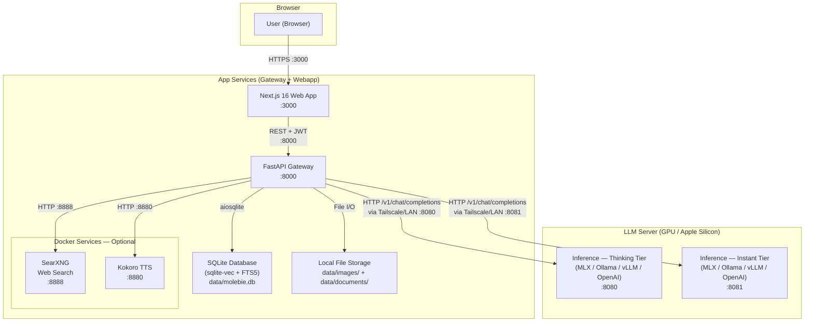


**Key points:**

- **Flexible deployment**: services can all run on one machine or be distributed freely across machines (see Section 10 & 12)
- 3 core services: **Webapp** (Next.js), **Gateway** (FastAPI + SQLite), **LLM Server** (MLX/Ollama/vLLM)
- Optional Docker services (SearXNG, Kokoro TTS) are co-located with Gateway
- **No Supabase dependency** — all data stored locally in SQLite with sqlite-vec for vector search and FTS5 for full-text search
- All inter-service communication is HTTP; no message queues or gRPC
- Gateway is the central orchestrator — routes to inference, RAG, web search, TTS, memory, summarization, and database
- `molebie-ai` CLI manages setup, configuration, and service lifecycle
- Docker is only required for optional services (SearXNG, Kokoro TTS)

---

## 2. Request Flow — Chat Completion (Streaming)

The main user-facing flow when sending a chat message, including web search, RAG, memory, and summarization:

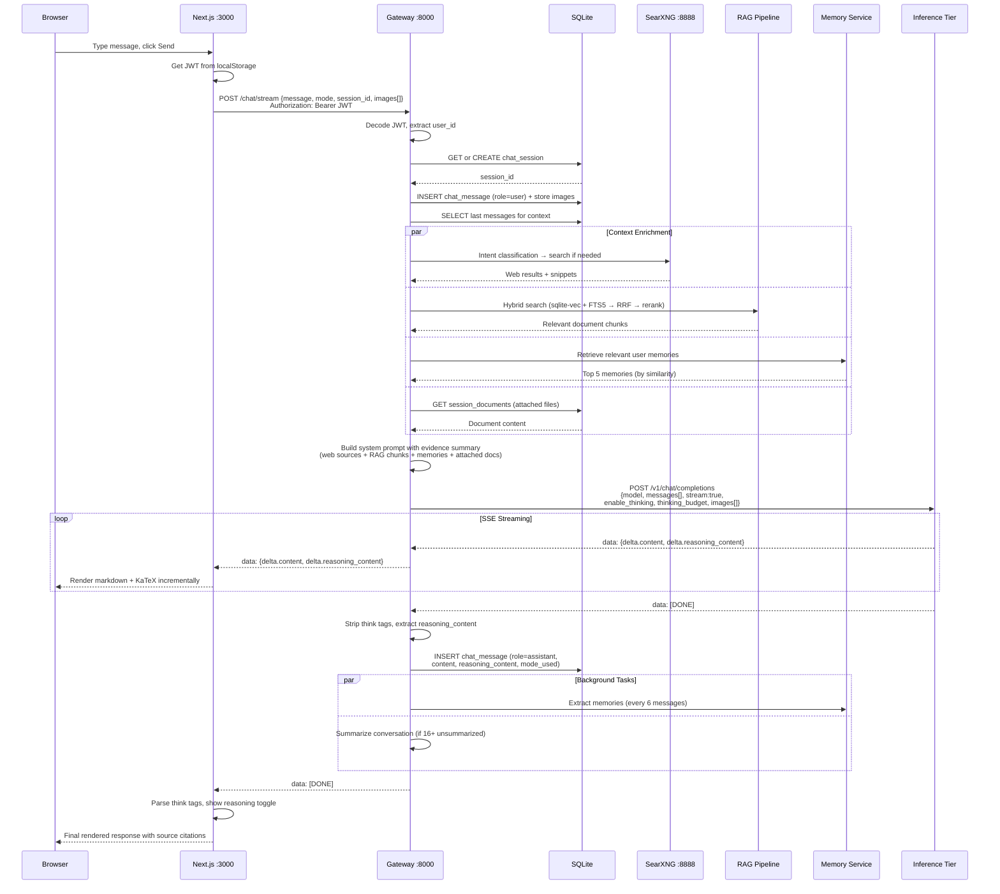


---

## 3. Authentication Flow

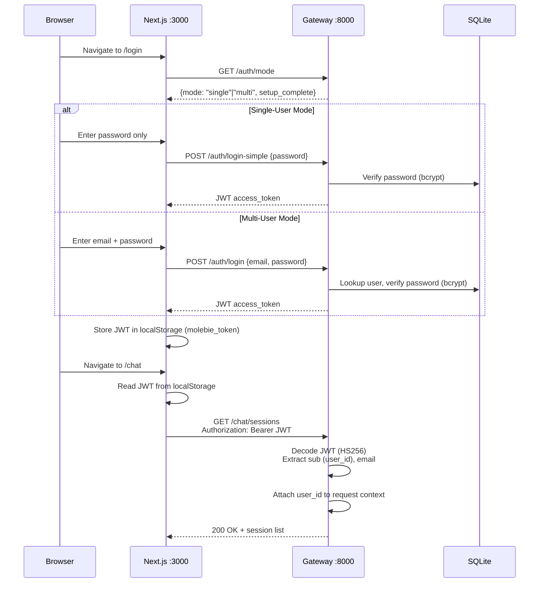


**Auth details:**

- **Gateway-managed auth** — no external auth provider (Supabase removed)
- JWTs signed with HS256 using a configurable secret
- Gateway decodes JWT locally (no external round-trip)
- All database queries filter by `user_id` for data isolation
- **Single-user mode**: password-only login, default user ID `00000000-0000-0000-0000-000000000001`
- **Multi-user mode**: email + password registration and login
- Token expiry: 7 days
- 401 responses trigger automatic logout + redirect to `/login`
- User registration via `POST /auth/register` (multi-user mode only)

---

## 4. Inference Mode Routing

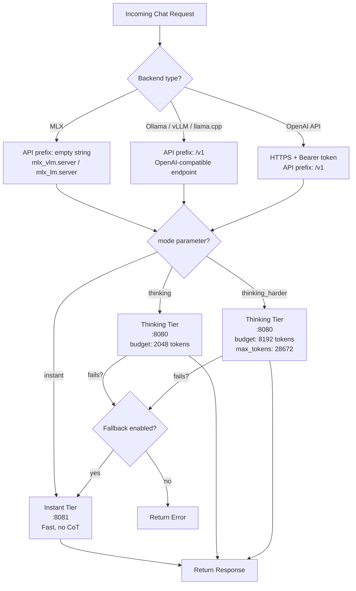


**Cost controls:**

- `THINKING_DAILY_REQUEST_LIMIT` caps heavy inference per user per day (default: 100)
- `THINKING_MAX_CONCURRENT` limits parallel thinking requests (default: 2)
- Fallback to instant tier is configurable via `ROUTING_THINKING_FALLBACK_TO_INSTANT`
- Cold-start timeout: 60s (configurable via `ROUTING_COLD_START_TIMEOUT`)

**Supported inference backends:**

- **MLX** (Apple Silicon) — `mlx_vlm.server` or `mlx_lm.server`, API prefix `""`
- **Ollama** — HTTP, API prefix `/v1`
- **vLLM** — HTTP, API prefix `/v1`
- **llama.cpp** — HTTP, API prefix `/v1`
- **OpenAI API** — HTTPS with Bearer token, API prefix `/v1`

---

## 5. Web Search Pipeline

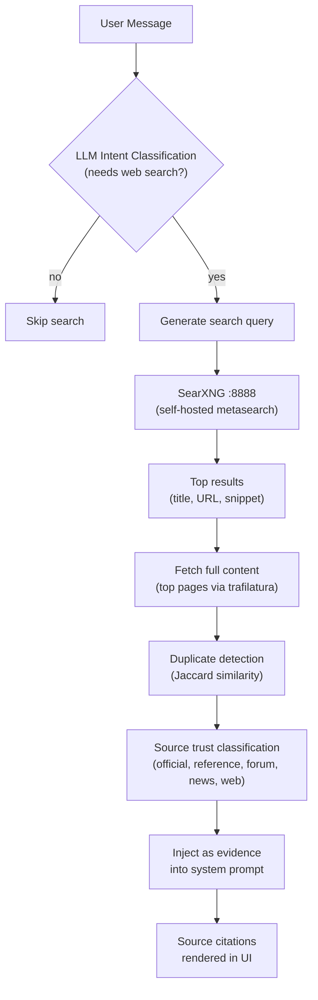

**Web search details:**

- Powered by **SearXNG** — self-hosted, privacy-respecting, no API keys needed
- **LLM intent classification** decides whether a query needs web results (configurable via `WEB_SEARCH_LLM_CLASSIFY`)
- Fetches full page content for top results via **trafilatura** (up to 2000 chars each)
- **Source trust classification**: official, reference, forum, news, web
- **Duplicate detection** via Jaccard similarity on word sets
- **Smart search triggers**: temporal keywords, news, weather, commerce, explicit intent
- Skips trivial queries (greetings) and code/creative tasks

---

## 6. RAG Pipeline (Document Retrieval)

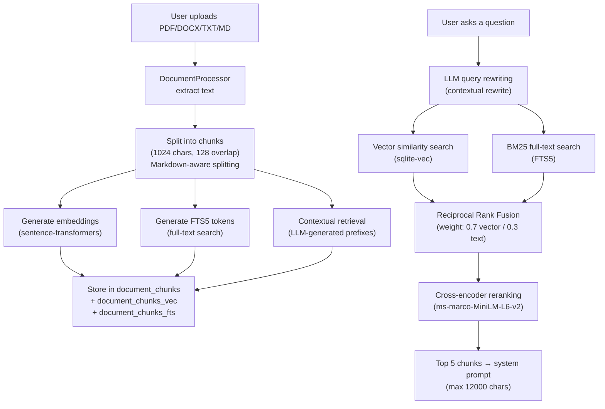

**RAG details:**

- **Hybrid search**: vector similarity (sqlite-vec) + BM25 full-text (FTS5) fused via RRF
- **Cross-encoder reranking** for final relevance scoring (`cross-encoder/ms-marco-MiniLM-L6-v2`)
- **Contextual retrieval**: LLM generates context prefixes for each chunk at ingest time (Anthropic technique, +35-49% retrieval quality)
- **LLM query rewriting**: contextual rewrite to improve retrieval
- **Session document attachments**: files can be attached to specific sessions and injected directly into the system prompt
- **Embedding model**: configurable (default: `Orange/orange-nomic-v1.5-1536`, 1536-dim)
- **RAG metrics**: performance logging with quality tracking via `rag_query_metrics` table
- Match count: 20 candidates, threshold: 0.3, max context: 12000 chars

---

## 7. Voice Pipeline

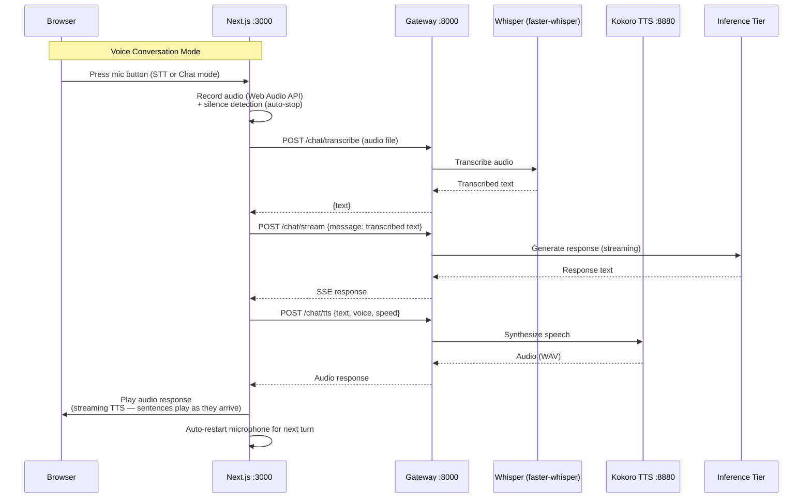

**Voice details:**

- **STT**: `faster-whisper` (local Whisper inference, "tiny" model ~75MB, CTranslate2 backend) via `POST /chat/transcribe`
- **TTS**: Kokoro FastAPI (Docker, CPU) with 12 voice options (British/American, male/female)
- **Two voice modes**: STT-only mode (transcribe without auto-send) and Chat mode (auto-send + streaming TTS response)
- **Silence detection**: audio threshold-based auto-stop recording
- **Stop commands**: "stop", "goodbye", "bye", "that's all", etc.
- **Streaming TTS**: sentences play as the LLM generates them (continuous audio)
- **Voice settings**: configurable voice, speed (0.5x–2.0x), auto-read toggle
- **Speaker verification** (optional): MFCC-based voice embeddings, 3-sample enrollment via `/chat/voice-enroll`

---

## 8. Database Schema (ER Diagram)

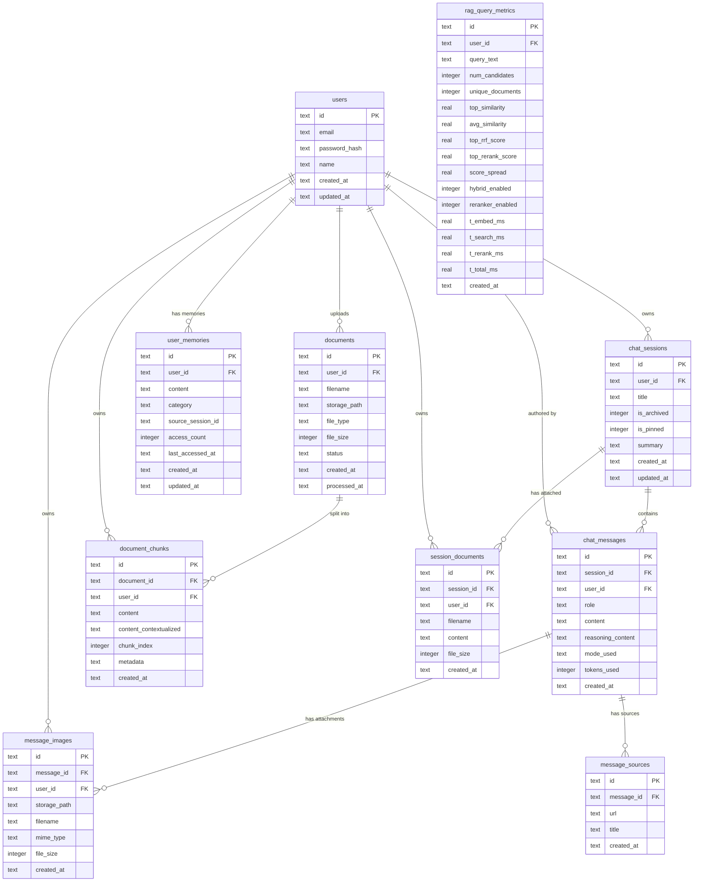


**Key schema features:**

- **SQLite** with WAL mode enabled for concurrent reads
- Foreign key constraints enforced for referential integrity
- User data isolation enforced at query level (every query filters by `user_id`)
- **sqlite-vec** virtual tables (`document_chunks_vec`, `user_memories_vec`) for vector similarity search
- **FTS5** virtual table (`document_chunks_fts`) for BM25 full-text search
- **RRF hybrid search** combining vector + BM25 results
- `mode_used` supports: `instant`, `thinking`, `thinking_harder`
- `message_images` stored locally in `data/images/`, metadata in table
- `session_documents` holds full-text content injected directly into system prompts
- `chat_sessions.is_pinned` for session pinning/favoriting
- `chat_sessions.summary` for rolling conversation summaries
- `user_memories` stores cross-session facts with categories: preference, background, project, instruction
- `user_memories` has access tracking (count + last_accessed_at) for relevance decay
- `message_sources` stores web search source URLs/titles per assistant message
- `rag_query_metrics` tracks RAG search performance with detailed timing breakdown
- Schema auto-initialized on first gateway start via `init_database()`

---

## 9. Gateway API Routes

```
/auth
  GET  /mode           — Get auth mode (single/multi) and setup state
  POST /register       — Register new user (multi-user mode only)
  POST /login          — Email + password login (multi-user mode)
  POST /login-simple   — Password-only login (single-user mode)
  GET  /me             — Get current authenticated user info

/health
  GET /                — Basic health check
  GET /auth            — JWT validation + user info
  GET /inference       — Inference tier status + routing info
  GET /deep            — Deep health checks (embedding, vector roundtrip)

/chat
  POST /               — Send message (full response)
  POST /stream         — Send message (SSE streaming)
  GET  /sessions       — List user sessions
  POST /sessions       — Create new session
  GET  /sessions/{id}/messages — Get session messages
  PATCH /sessions/{id}     — Rename session
  PATCH /sessions/{id}/pin — Pin/unpin session
  DELETE /sessions/{id}    — Delete session
  GET  /image/{image_id}   — Download message image
  GET  /sessions/{id}/images — List images in session
  POST /transcribe     — Whisper STT (audio → text)
  POST /tts            — Kokoro TTS (text → audio)
  POST /voice-enroll   — Voice profile enrollment
  GET  /voice-profile  — Get voice profile status
  DELETE /voice-profile — Delete voice profile

/documents
  POST /upload         — Upload file for RAG processing (PDF/DOCX/TXT/MD, up to 50MB)
  GET  /               — List user documents
  DELETE /{id}         — Delete document + chunks
  POST /reindex        — Re-embed missing document chunk vectors
  POST /sessions/{id}/attach           — Attach document to session
  GET  /sessions/{id}/attachments      — List session attachments
  DELETE /sessions/{id}/attachments/{id} — Remove attachment
  POST /evaluate       — RAG evaluation with test cases
```

---

## 10. Physical Deployment / Network Topology

The CLI installer (`molebie-ai install`) lets users choose how to distribute services across machines. Each service can run locally or remotely.

### All-in-one (single machine)

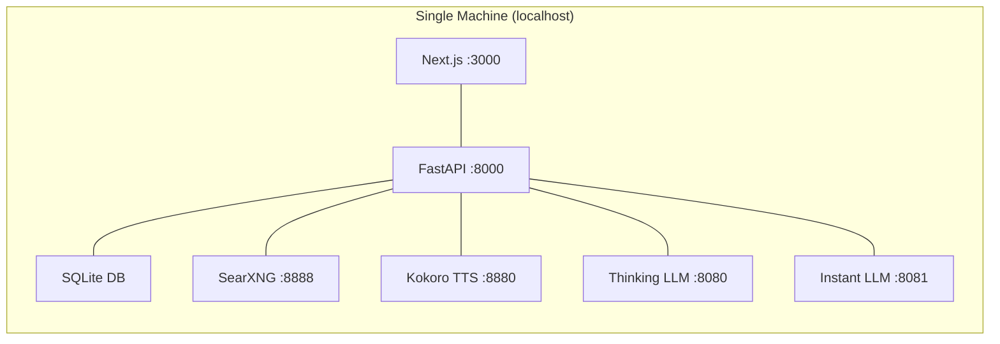

### Frontend + API (LLM on another machine)

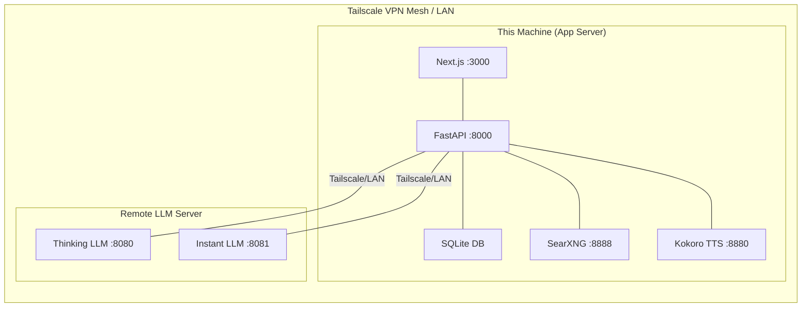

### LLM Server (dedicated GPU node)

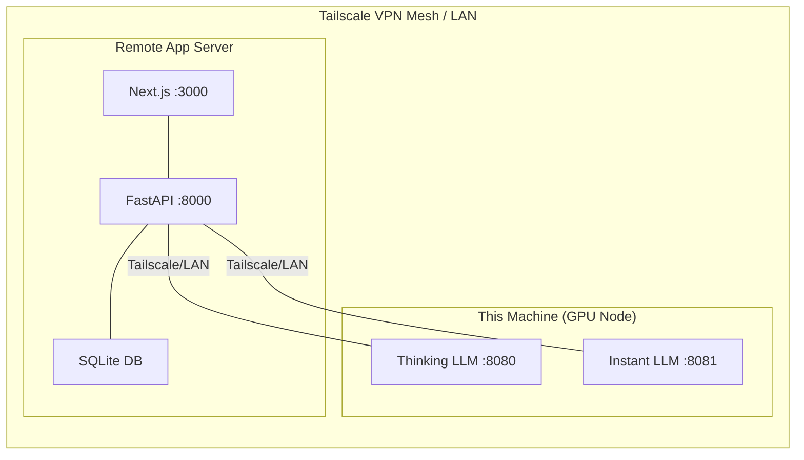

**Deployment details:**

- **All-in-one**: Everything on localhost — the default, zero configuration
- **Frontend + API**: Webapp + Gateway on this machine, LLM on a remote GPU machine (e.g. Mac with Apple Silicon)
- **LLM server**: This machine only runs inference — app + API run elsewhere
- **Custom**: Any combination of services per machine (via CLI "Custom" option)
- Machines connect via **Tailscale VPN** or LAN — IPs configured during setup
- Optional services (SearXNG, Kokoro TTS) always co-located with Gateway
- **Auto-pull daemon**: macOS LaunchAgent polls git and auto-updates on new commits

---

## 11. Frontend Page Structure

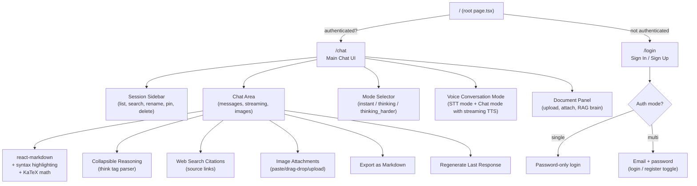


**Frontend stack:** Next.js 16 (App Router), React 19, TypeScript, Tailwind CSS v4, Geist Mono font, dark glass UI theme with green accents. State is managed purely with React hooks (no external state library).

**Key frontend features:**

- Voice conversation mode with STT-only and Chat (auto-send + streaming TTS) modes
- Document upload/attachment for RAG and per-session context
- Image upload via paste, drag-and-drop, or file picker (stored locally)
- Web search source citations with clickable links
- KaTeX math rendering in messages
- Session pinning/favoriting and search (when 5+ sessions)
- Export conversations as Markdown
- Regenerate last assistant response
- Upload progress tracking (upload → extract → chunk → embed → done)
- Responsive mobile design with drawer sidebar

---

## 12. CLI Tool (molebie-ai)

### Commands Overview

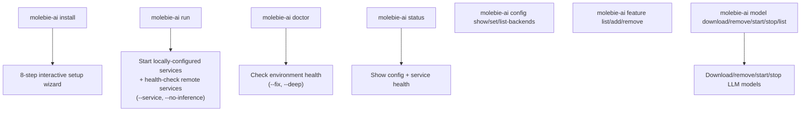

### Install Wizard — Full Flow (8 Steps)

```
┌─────────────────────────────────────┐
│         Step 1: System Check        │
│  Check RAM, disk, Apple Silicon     │
└──────────────────┬──────────────────┘
                   │
┌──────────────────▼──────────────────┐
│     Step 2: Deployment Layout       │
│                                     │
│  [1] All-in-one                     │
│  [2] Frontend + API                 │
│  [3] LLM server                    │
│  [4] Custom                         │
└──┬───────┬───────┬───────┬──────────┘
   │       │       │       │
   ▼       ▼       ▼       ▼
┌──────┐ ┌──────┐ ┌──────┐ ┌──────────────────────┐
│  1   │ │  2   │ │  3   │ │         4            │
│      │ │      │ │      │ │                      │
│ All  │ │ Ask: │ │ LLM  │ │  Run LLM?    [Y/n]   │
│local │ │ LLM  │ │ only │ │  Run Gateway?[Y/n]   │
│      │ │ host?│ │      │ │  Run Webapp? [Y/n]   │
│ No   │ │      │ │ No   │ │                      │
│ Qs   │ │ 1 Q  │ │ Qs   │ │  Then ask hosts for  │
│      │ │      │ │      │ │  needed connections   │
└──┬───┘ └──┬───┘ └──┬───┘ └────────┬─────────────┘
   │        │        │              │
   │    Shows:   Shows:         Shows:
   │    "On the  "On the        summary +
   │    other    other          "On the other
   │    machine: machine:       machine(s)..."
   │    LLM      Frontend+API
   │    server"  → set LLM
   │             host to
   │             this IP"
   │        │        │              │
   ▼        ▼        ▼              ▼
┌──────────────────────────────────────────┐
│  Config result:                          │
│                                          │
│  run_inference = true/false              │
│  run_gateway   = true/false              │
│  run_webapp    = true/false              │
│  inference_host / gateway_host /         │
│  webapp_host   (if remote)               │
└──────────────────┬───────────────────────┘
                   │
                   ▼
┌──────────────────────────────────────────┐
│  Step 3: Inference Backend               │
│                                          │
│  if run_inference=false → auto-select    │
│    OpenAI-compatible, ask endpoint URL   │
│  if run_inference=true  → detect best:   │
│    MLX / Ollama / OpenAI-compatible      │
└──────────────────┬───────────────────────┘
                   │
┌──────────────────▼──────────────────┐
│     Step 4: Model Profile           │
│  light / balanced / custom          │
│  (skipped if OpenAI-compatible)     │
└──────────────────┬──────────────────┘
                   │
┌──────────────────▼──────────────────┐
│     Step 5: Optional Features       │
│  Search [Y/n]  RAG [Y/n]  Voice    │
│  (skipped if gateway is remote)     │
└──────────────────┬──────────────────┘
                   │
┌──────────────────▼──────────────────┐
│     Step 6: Review                  │
│  Show all settings in table         │
│  Proceed? [Y/n]                     │
└──────────────────┬──────────────────┘
                   │
┌──────────────────▼──────────────────────────────┐
│     Step 7: Installing                          │
│                                                 │
│  ├─ Prerequisites (Python, Node)                │
│  ├─ Generate .env.local                         │
│  ├─ Gateway deps    (skip if !run_gateway)      │
│  ├─ Webapp deps     (skip if !run_webapp)       │
│  ├─ Backend setup   (skip if !run_inference)    │
│  ├─ Embedding model (skip if !run_gateway)      │
│  └─ Features setup  (skip if !run_gateway)      │
└──────────────────┬──────────────────────────────┘
                   │
┌──────────────────▼──────────────────┐
│     Step 8: Complete                │
│  Summary table                      │
│  Start Molebie AI now? [Y/n]        │
└─────────────────────────────────────┘
```

### Step 2 Presets — What Runs Where

| Preset | This machine runs | Remote | Follow-up Qs | Other machine instructions |
|--------|-------------------|--------|-------------|---------------------------|
| **All-in-one** | LLM + Gateway + Webapp | — | None | — |
| **Frontend + API** | Gateway + Webapp | LLM | "LLM host?" (1 Q) | Run `molebie-ai install` → choose "LLM server" |
| **LLM server** | LLM only | Gateway + Webapp | None | Run `molebie-ai install` → choose "Frontend + API", set LLM host to this machine's IP |
| **Custom** | User picks individually | User picks | Per-service Y/n + host prompts | Shown based on selection |

### Service Dependency Chain

```
Browser → Webapp (:3000) → Gateway (:8000) → LLM Server (:8080/:8081)
                                 │
                                 ├── SQLite DB (local file)
                                 ├── SearXNG (:8888, optional)
                                 └── Kokoro TTS (:8880, optional)
```

Only ask for remote hosts that local services need to connect to:
- **Gateway** needs → LLM Server address (if LLM is remote)
- **Webapp** needs → Gateway address (if Gateway is remote)
- **Gateway** needs → Webapp address for CORS (if Webapp is remote)
- **LLM Server** needs → nothing (it just listens)

### Config Schema (v3)

```json
{
  "version": 3,
  "setup_type": "single | distributed",
  "run_inference": true,
  "run_gateway": true,
  "run_webapp": true,
  "inference_host": "localhost",
  "gateway_host": "localhost",
  "webapp_host": "localhost",
  "inference_backend": "mlx | ollama | openai-compatible",
  "model_profile": "light | balanced | custom",
  "thinking_model": "...",
  "instant_model": "...",
  "search_enabled": true,
  "rag_enabled": true,
  "voice_enabled": false
}
```

**CLI details:**

- **Framework**: Python + Typer + Rich
- **Entry point**: `molebie-ai` (installed via `pip install -e .`)
- **Config storage**: `.molebie/config.json` (version 3, auto-migrates from v2)
- **Env generation**: Auto-generates `.env.local` from CLI config (including random JWT secret)
- **Prerequisite checker**: Detects and offers to install missing dependencies
- **Service manager**: Starts/stops only locally-configured services, health-checks remote ones
- **Model management**: Download, remove, start, and stop LLM models per backend
- **Feature management**: Enable/disable voice, search, RAG services
- **Doctor**: Diagnose and optionally fix setup issues
- **Smart install**: Only installs dependencies for services running on this machine

---

## 13. Memory & Summarization Services

```mermaid
flowchart TD
    subgraph memory [Cross-Session Memory]
        Msg6["Every 6 messages"]
        Extract["LLM extracts structured facts"]
        Categorize["Categorize:\npreference / background /\nproject / instruction"]
        Dedup["Deduplicate via cosine similarity\n(threshold: 0.9)"]
        StoreM["Store in user_memories\n+ user_memories_vec"]
        Retrieve["Retrieve top 5 memories\n(similarity > 0.5)\nfor system prompt"]
    end

    subgraph summary [Conversation Summarization]
        Trigger["16+ unsummarized messages"]
        Summarize["LLM generates rolling summary\n(max 300 tokens)"]
        StoreS["Store in chat_sessions.summary"]
        Inject["Inject summary into context\n(keeps last 10 messages raw)"]
    end

    Msg6 --> Extract --> Categorize --> Dedup --> StoreM
    StoreM -.->|"on next query"| Retrieve
    Trigger --> Summarize --> StoreS --> Inject
```

**Memory details:**

- **Cross-session memory**: extracts and stores user facts/preferences across conversations
- Categories: preference, background, project, instruction
- Deduplication via cosine similarity (threshold: 0.9)
- Retrieval: top 5 memories by vector similarity (threshold: 0.5)
- Auto-extraction every 6 messages (configurable via `MEMORY_EXTRACT_INTERVAL`)
- Max 200 memories per user
- Access tracking for relevance decay

**Summarization details:**

- Rolling conversation summaries to manage context window
- Trigger: 16+ unsummarized messages (configurable via `SUMMARY_TRIGGER_THRESHOLD`)
- Keeps last 10 messages raw (not summarized)
- Max 300 output tokens per summary
- Background task runs after each assistant message

---

## Summary Table

| Service | Port | Framework | Purpose |
|---------|------|-----------|---------|
| **Web App** | 3000 | Next.js 16 | Chat UI, auth, voice, documents, images |
| **Gateway** | 8000 | FastAPI | Auth, routing, DB, inference proxy, RAG, web search, TTS, memory, summarization, SSE streaming |
| **SQLite DB** | — | sqlite-vec + FTS5 | Local database with vector search and full-text search |
| **Thinking LLM** | 8080 | MLX / Ollama / vLLM / OpenAI | Deep reasoning with chain-of-thought |
| **Instant LLM** | 8081 | MLX / Ollama / vLLM / OpenAI | Fast responses, no CoT |
| **SearXNG** | 8888 | Docker | Self-hosted web search (no API keys) |
| **Kokoro TTS** | 8880 | Docker (FastAPI) | Text-to-speech (12 voices, CPU) |
| **Tailscale** | — | VPN mesh | Connects server + GPU node (optional) |
| **CLI** | — | Python (Typer) | Setup wizard, service management, model management, diagnostics |

The gateway is the central orchestrator: it authenticates every request (JWT + bcrypt), manages sessions/messages in SQLite, routes to the appropriate inference tier, enriches context with web search and RAG results, retrieves cross-session user memories, manages conversation summarization, handles voice transcription and synthesis, manages image attachments via local storage, builds evidence-augmented system prompts, handles streaming, extracts reasoning content, and applies cost controls.
